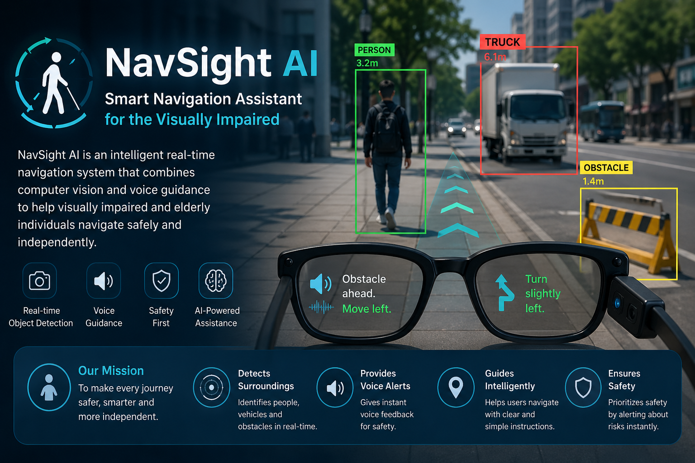

# 🚀 NavSight AI  
### Intelligent Vision-Based Navigation Assistant  



---

## 🧠 Overview  
NavSight AI is an intelligent assistive system designed to help visually impaired and elderly individuals navigate safely and independently.

Unlike traditional navigation systems, NavSight AI does not just provide directions—it understands the environment using real-time computer vision and gives **actionable voice guidance**.

It transforms object detection into a **decision-making safety assistant**.

---

## 🎤 Elevator Pitch  
NavSight AI is a real-time AI-powered vision assistant that detects surroundings, understands context, and provides smart voice guidance to ensure safe and independent navigation.

---

## 💡 Inspiration  
Navigation is something most people take for granted, but for visually impaired individuals, it can be challenging and risky.

Existing systems lack real-time awareness of surroundings. NavSight AI was built to bridge this gap by combining artificial intelligence with assistive technology to improve safety, independence, and confidence.

---

## ✨ Features  

- 🎯 Real-time object detection (YOLO)  
- 🧍 Human awareness system  
- 🚛 Vehicle danger detection (STOP alerts)  
- 🧠 Smart decision-making logic  
- 🔊 Voice guidance system  
- 🎯 Closest object prioritization  
- 🧠 Memory system (prevents repeated alerts)  
- 🏠 Optimized for indoor environments  

---

## 🧠 What It Does  

- Detects objects like people, vehicles, and obstacles  
- Determines distance (far / near / very close)  
- Detects direction (left / right / center)  
- Gives smart voice instructions:
  - “Move left”
  - “Obstacle ahead”
  - “Stop immediately, truck very close”  
- Prioritizes safety over everything  

---

## ⚙️ How It Works  

### 1. Vision System  
Uses YOLO (Ultralytics) for real-time object detection.

### 2. Filtering System  
Filters only important objects:
- People  
- Vehicles  
- Furniture  
- Common obstacles  

### 3. Decision Engine  
- Selects the closest object  
- Classifies object type  
- Generates safety-based instructions  

### 4. Voice Output  
Uses text-to-speech to give real-time feedback.

### 5. Memory System  
Prevents repeated instructions and improves user experience.

---

## ⚠️ Challenges We Faced  

- Real-time processing without lag  
- Combining detection + decision-making  
- Avoiding excessive voice output  
- Prioritizing safety intelligently  
- Balancing accuracy and performance  

---

## 🛠️ Tech Stack  

- Python  
- Ultralytics YOLOv8  
- OpenCV  
- pyttsx3  
- NumPy  

---

## 📦 Installation  

```bash
git clone https://github.com/your-username/navsight-ai.git
cd navsight-ai

pip install -r requirements.txt
python detect.py
>>>>>>> 08b042b72feaf356ad240a69bca2ba67e18553ae
